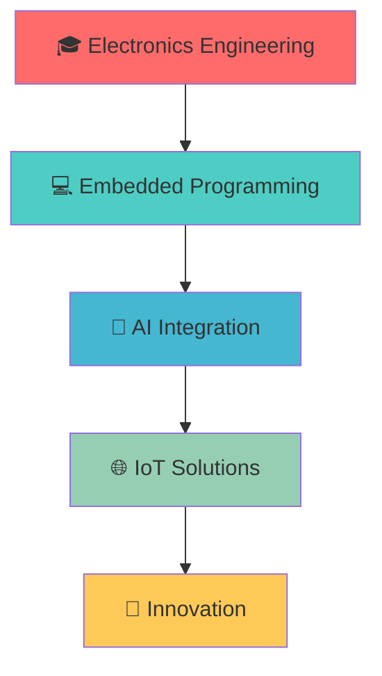

#  Xin chào, mình là Arilla26!

<div align="center">
  
</div>

<p align="center">
  
  
</p>

---

## 🚀 Về mình

```typescript
const arilla26 = {
    pronouns: "he" | "him",
    code: ["C", "C++", "Python", "JavaScript"],
    askMeAbout: ["embedded systems", "AI", "electronics", "IoT"],
    technologies: {
        microcontrollers: ["STM32", "Arduino", "ESP32"],
        tools: ["STM32CubeIDE", "Arduino IDE", "VS Code"],
        frameworks: ["Pygame", "TensorFlow", "OpenCV"],
        databases: ["MySQL", "SQLite"],
        misc: ["Git", "Linux", "PCB Design"]
    },
    currentFocus: "Developing intelligent embedded systems",
    funFact: "I debug hardware and software with equal enthusiasm!"
};
```

---

## 🛠️ Tech Stack & Tools

<div align="center">

### 💻 Programming Languages


### 🔧 Hardware & Embedded


### 🧠 AI & Machine Learning


### 🛠️ Tools & IDEs


</div>

---

## 🏆 Dự án nổi bật

<div align="center">

### ♟️ Chess AI


> 🧠 AI chơi cờ vua thông minh sử dụng thuật toán Minimax và Alpha-Beta Pruning
> 
> **Tính năng:** Giao diện đồ họa, nhiều mức độ khó, phân tích nước đi
> 
> [🔗 Xem dự án](https://github.com/Arilla26/Chess_AI) | [📖 Documentation](https://github.com/Arilla26/Chess_AI#readme)

---

### 🌐 IOT Lab


> 🔌 Bộ sưu tập các dự án IoT và hệ thống nhúng
> 
> **Nội dung:** Cảm biến, giao tiếp không dây, xử lý tín hiệu số
> 
> [🔗 Xem dự án](https://github.com/Arilla26/IOT_Lab) | [📚 Labs](https://github.com/Arilla26/IOT_Lab#labs)

---

### 🕹️ TouchScreen Interface


> 📱 Giao diện cảm ứng tương tác trên vi điều khiển STM32
> 
> **Đặc điểm:** Multi-touch, responsive UI, real-time feedback
> 
> [🔗 Xem dự án](https://github.com/Arilla26/Lab7_TouchScreen) | [🎥 Demo](https://github.com/Arilla26/Lab7_TouchScreen#demo)

</div>

---

## 📊 GitHub Analytics

<div align="center">
  
  
</div>

<div align="center">
  
</div>

<div align="center">
  
</div>

---

## 🎯 Current Focus

<div align="center">



</div>

- 🔭 Hiện tại đang nghiên cứu về **AI trên hệ thống nhúng**
- 🌱 Đang học **Machine Learning** và **Computer Vision**
- 👯 Tìm kiếm cơ hội hợp tác trong các dự án **IoT** và **Embedded AI**
- 💬 Hỏi mình về **STM32**, **Arduino**, **Python**, hoặc **AI algorithms**
- ⚡ Fun fact: **Tôi có thể debug cả phần cứng và phần mềm!**

---

## 🏅 Achievements & Certifications

<div align="center">

| 🏆 Achievement | 📅 Date | 🔗 Link |
|:---|:---:|:---:|
| 🥇 Best Embedded Project | 2024 | [Certificate](#) |
| 🎓 STM32 Certified Developer | 2023 | [Verify](#) |
| 🤖 AI Programming Specialist | 2023 | [Badge](#) |

</div>

---

## 📈 Contribution Graph

<div align="center">
  
</div>

---

## 🤝 Let's Connect!

<div align="center">

[](https://linkedin.com/in/your-profile)
[](mailto:your.email@gmail.com)
[](https://github.com/Arilla26)
[](https://discord.gg/your-discord)

</div>

---

<div align="center">
  
</div>

<div align="center">
  <i>⭐️ From <a href="https://github.com/Arilla26">Arilla26</a> with ❤️</i>
</div>